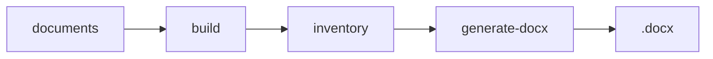

# Reference: GitHub README structure and examples

Supporting documentation for the **github-readme** skill. Use for badge details, common blocks, and section examples.

---

## 1. Badges (shields.io)

### Generic format

```markdown
[](URL)
```

### "for-the-badge" style (wider)

```markdown
[](https://laravel.com)
[](https://vuejs.org)
```

### Flat style (plain text)

```markdown
[](https://nodejs.org/)
[](https://www.ruby-lang.org/)
[](https://www.postgresql.org/)
[](LICENSE)
```

### Best practices

- One line of badges right below title/version.
- Include: language, runtime, main framework, DB, tools (Docker, Mermaid, etc.), license.
- Keep same style (for-the-badge or flat) across the README.

---

## 2. Title and description

### Title (H1)

- Repo/project name; optionally emoji at start: `# 🚀 Project Name`.
- Followed by blank line and, if desired, version or tagline in bold.

Example:

```markdown
# document-llm-creator

**Version 1.1.0** — Tables, **bold** in text, Mermaid images, example showcase.
```

### Description

- One or two paragraphs: what it is, what it's for, main highlight.
- May include link to extra docs (e.g. `.agents/README.md`).

---

## 3. Preview (image / GIF)

Place after description, with caption in *italics*:

```markdown
## 🖼️ Application Preview


*Optional caption describing the image.*
```

---

## 4. Mermaid diagrams

- On GitHub, Mermaid renders natively inside ` ```mermaid ` blocks.
- For READMEs in other contexts (e.g. Word/PDF), you may need to export PNG and use ``.

Example block in README:

```markdown
## How it works


*Diagram source: docs/pipeline.mmd. Regenerate PNG with `node scripts/render-readme-diagram.js`.*
```

If the diagram lives in the README itself, use a block like this:

````

````

---

## 5. Quick start

- Section titled "Quick start" or "Quick steps".
- Prerequisites as a list.
- Numbered steps with commands in code blocks (bash, shell).
- Links to URLs (app, admin, auth) if applicable.

Minimal example:

- **Prerequisites:** Ruby 3.2+, Docker and Docker Compose
- **Clone and install:** `git clone ...`, `cd repo`, `bundle install`
- **Setup and run:** `rails db:create db:migrate db:seed`, `rails server`
- **App:** http://localhost:3000

---

## 6. Tables (commands, structure)

### Commands

| Command | Description |
|--------|-------------|
| `npm run doc -- <id>` | Build and generate document. |
| `npm run new-doc -- <id>` | Create new document folder. |
| `rails server` | Start the application. |

### Project structure

| Path | Description |
|------|-------------|
| `core/` | Build, generate, config. |
| `documents/<id>/` | Manifest, spec, section JSONs. |
| `output/` | Generated .docx and artifacts. |

---

## 7. Minimal usage example

Include an "Example" or "Quick example" block with commands that run immediately (e.g. `npm install`, `npm run doc -- example`).

---

## 8. License

At the end of the README:

```markdown
## License

MIT — see [LICENSE](LICENSE).
```

---

## 9. Pre-generation checklist (for the agent)

- [ ] Project name and description confirmed
- [ ] Badges: language(s), main libs, license
- [ ] Objective / "How it works" defined
- [ ] Quick start with steps and commands
- [ ] Mermaid or preview image only if the user wants them
- [ ] Command and structure tables if they make sense
- [ ] Usage example and license

After collecting answers, **ask**: "Do you want to change anything before I generate the README?" and only then write.
